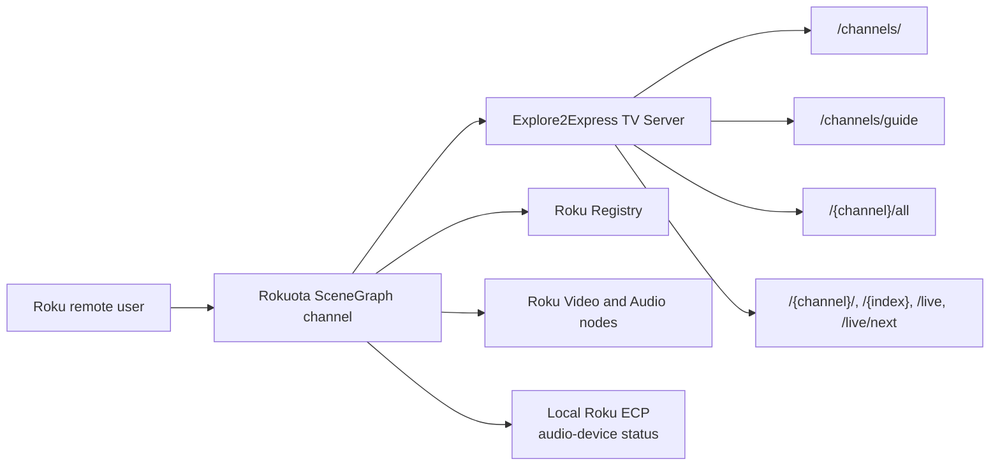
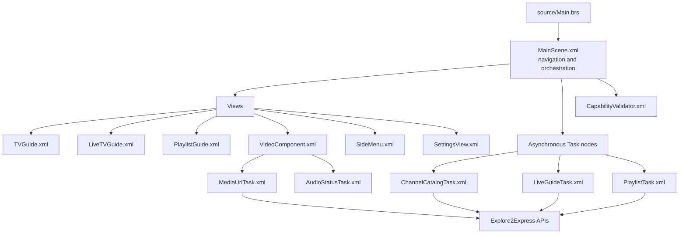
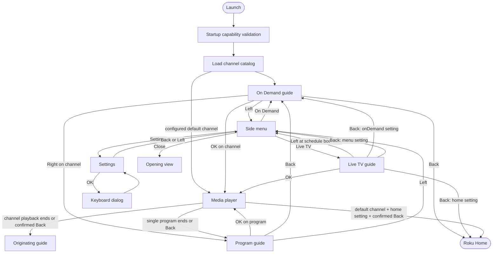

# Rokuota High-Level Design

## 1. Purpose and Scope

Rokuota is a Roku SceneGraph channel that presents on-demand and live television
content from an Explore2Express TV Server. Users can browse channels, inspect a
channel's programs, watch or listen to resolved media, view a live schedule, and
configure the server URL.

This document describes the application's runtime architecture, main views,
navigation paths, data flows, and the source files that implement them.

## 2. Technology and Runtime Model

- **Platform:** Roku SceneGraph
- **Languages:** SceneGraph XML and BrightScript
- **Resolution:** Full HD (`1920x1080`)
- **Build:** BrighterScript, configured by `bsconfig.json`
- **Application entry point:** `source/Main.brs`
- **Root scene and navigation coordinator:** `components/MainScene.xml`
- **Backend:** Explore2Express HTTP APIs for catalogs, schedules, playlists,
  and resolved media URLs
- **Persistence:** Roku registry sections `AppSettings` and
  `PlaybackCapabilities`

The application does not use a route or navigator framework. `MainScene` owns
all top-level views at once and acts as a state machine by changing their
`visible` state, transferring focus, and responding to observed SceneGraph
fields.

## 3. System Context

## 4. Runtime Architecture

`source/Main.brs` creates the SceneGraph screen and `MainScene`, then keeps the
channel alive until the scene requests closure. `MainScene` observes output
fields from views and tasks, updates its navigation state, and owns global
loading and error dialogs.

Network operations execute in SceneGraph `Task` components rather than on the
render thread. Successful tasks publish `ContentNode` trees to their observers;
failures publish user-facing error messages.

## 5. Main Views and Files

| View | Purpose | Main controls | Representing file |
|---|---|---|---|
| Startup capability/intro view | Optionally plays an intro and determines whether the device can prebuffer a second video | Automatic; no primary navigation | `components/CapabilityValidator.xml` |
| On Demand guide | Lists available channels and is the default application view | Up/Down selects; OK plays the channel; Right browses programs; Left opens menu; Back exits the channel | `components/TVGuide.xml` |
| Live TV guide | Displays channels and a time-proportional program schedule | Up/Down changes channel; Left/Right changes program; OK tunes live; Left at the earliest program opens menu; Back follows manifest configuration | `components/LiveTVGuide.xml` |
| Program guide | Lists all programs in one on-demand channel | Up/Down selects; OK plays one program; Back returns to On Demand; Left opens menu | `components/PlaylistGuide.xml` |
| Media player | Resolves and plays video or audio, advances playlists, prefetches upcoming media, and displays metadata | OK toggles video metadata; Play/Pause controls playback; transport/arrow keys seek; Back returns immediately for a single item or opens confirmation for a channel playlist | `components/VideoComponent.xml` |
| Side menu | Global overlay for switching areas | On Demand, Live TV, or Settings; Left/Right/Back closes the menu | `components/SideMenu.xml` |
| Settings | Displays and edits the server URL | OK opens keyboard; Back or Left returns to the side menu | `components/SettingsView.xml` |
| Keyboard dialog | Edits the server URL and writes it to the Roku registry | OK saves; Cancel discards | Created by `components/SettingsView.xml` |
| Loading dialog | Indicates catalog, guide, or playlist loading | Automatic | Created by `components/MainScene.xml` |
| Error state | Shows an error dialog over looping TV static for API failures | OK dismisses and returns to the appropriate guide or Settings | Coordinated by `components/MainScene.xml`; media asset `tvstatic2p.mp4` |

The side menu is an overlay rather than a replacement screen. It remembers the
view that opened it so closing the menu restores focus to On Demand, Live TV,
or the program guide.

## 6. Navigation Design

### 6.1 Navigation Map

### 6.2 Transition Details

| From | Trigger | To | Coordinator behavior |
|---|---|---|---|
| Launch | Capability validation completes | On Demand | Loads the catalog, supplies it to `TVGuide`, then gives the guide focus |
| Launch | Catalog contains configured `default_channel` | Player | Loads and starts that channel without first focusing the guide |
| On Demand | OK on channel | Player | Loads the channel playlist and starts continuous on-demand or shuffled playback |
| On Demand | Right on channel | Program guide | Loads the full playlist in browse mode and displays its entries |
| On Demand | Left | Side menu | Shows the overlay and records `tvGuide` as the focus return target |
| Program guide | OK on program | Player | Starts only the selected item and records `playlistGuide` as the return target |
| Program guide | Back | On Demand | Hides the program guide and restores On Demand focus |
| Program guide | Left | Side menu | Shows the overlay and records `playlistGuide` as the focus return target |
| Live TV | OK on a current program | Player | Resolves the selected channel's live URL and enables continuous live progression |
| Live TV | Left at earliest browsable program | Side menu | Opens the global menu; otherwise Left moves through schedule entries |
| Live TV | Back | Configurable | `live_guide_back_destination` selects On Demand, side menu, or Roku Home |
| Any guide | Menu selection: On Demand | On Demand | Reloads the channel catalog from the current server URL |
| Any guide | Menu selection: Live TV | Live TV | Loads the live schedule derived from the current server URL |
| Any guide | Menu selection: Settings | Settings | Hides the menu and opens Settings with the current URL |
| Settings | Back or Left | Side menu | Closes Settings and reopens the menu |
| Player | Playback completes/fails through its bounded playlist | Originating guide | `MainScene` restores the guide recorded in `playbackReturnTarget` |
| Player | Back during a single program | Program guide | Ends immediately and returns to the program list |
| Player | Back during channel/live playback | Confirmation dialog | Continue resumes focus; Return ends playback and restores the originating guide |
| Player | Back during auto-started default channel | Roku Home or On Demand | Controlled by `default_channel_back_destination` |

## 7. Core Data Flows

### 7.1 Startup and Catalog

1. `source/Main.brs` creates `MainScene`.
2. `MainScene` reads manifest configuration and the persisted `server_url`.
3. `CapabilityValidator` optionally plays the startup media and tests
   dual-video prebuffering.
4. `ChannelCatalogTask` requests the configured channel catalog URL.
5. The task validates the JSON array and maps each valid channel to a
   `ContentNode`.
6. `MainScene` assigns the content to `TVGuide` or starts a matching
   `default_channel`.

### 7.2 On-Demand Playback

1. A selection from `TVGuide` causes `MainScene` to run `PlaylistTask`.
2. `PlaylistTask` supports the server-random JSON envelope plus PLS and M3U
   playlists.
3. Normal channel selection starts continuous playback. Right/browse selection
   instead publishes the playlist to `PlaylistGuide`.
4. `VideoComponent` runs `MediaUrlTask` for entries that require server-side
   URL resolution.
5. Upcoming items are resolved ahead of time. Video may use a hidden second
   `Video` node for prebuffering when the device supports it.
6. Completion returns to On Demand, or to `PlaylistGuide` for single-item
   playback.

### 7.3 Live TV Playback

1. The side menu requests Live TV.
2. `MainScene` derives `/channels/guide` from the configured server URL.
3. `LiveGuideTask` converts channels and scheduled entries into a `ContentNode`
   hierarchy.
4. `LiveTVGuide` presents the schedule and updates its now-playing state every
   30 seconds.
5. OK tunes `/{channel}/live`. The player prefetches the next live item and
   progresses through the channel schedule.
6. Playback returns to `LiveTVGuide`.

### 7.4 Settings

1. `MainScene` resolves the initial server URL from the manifest and
   `AppSettings/server_url`.
2. Settings opens a Roku `KeyboardDialog`.
3. Saving writes the value to `AppSettings`, notifies `MainScene`, and
   invalidates cached On Demand and Live TV content.
4. Selecting a guide from the menu fetches fresh content with the updated URL.

### 7.5 Error Handling

- Catalog, live-guide, and playlist failures stop loading and show a global
  dialog over the static-video error state.
- Dismissing a global API error restores the active guide or Settings,
  depending on the operation that failed.
- Unsupported/offline channels use a normal dialog without replacing the
  current guide.
- Media resolution and playback failures are managed inside
  `VideoComponent`, which attempts bounded fallback/advancement and reports
  status before ending playback when necessary.
- Catalog and media tasks validate response type, required fields, HTTP status,
  and timeouts before publishing data.

## 8. Component Responsibilities and File Map

### Application Coordination

| File | Responsibility |
|---|---|
| `source/Main.brs` | Creates and displays the SceneGraph screen; closes it when requested |
| `components/MainScene.xml` | Root scene, navigation state machine, task orchestration, focus management, dialogs, settings coordination |
| `manifest` | Channel metadata and runtime configuration |
| `bsconfig.json` | BrighterScript packaging inputs and output archive |

### Views and Reusable UI

| File | Responsibility |
|---|---|
| `components/TVGuide.xml` | On Demand channel guide |
| `components/LiveTVGuide.xml` | Live schedule and channel selection |
| `components/PlaylistGuide.xml` | Programs within an On Demand channel |
| `components/VideoComponent.xml` | Video/audio playback and now-playing UI |
| `components/SideMenu.xml` | Global navigation overlay |
| `components/SettingsView.xml` | Server settings screen |
| `components/GuideBackground.xml` | Manifest-configured video/image backgrounds for guides |
| `components/ChannelGuideItem.xml` | On Demand channel row renderer |
| `components/VideoItemComponent.xml` | Program row renderer |
| `components/SettingsItemRenderer.xml` | Settings row renderer |

### Background Services

| File | Responsibility |
|---|---|
| `components/ChannelCatalogTask.xml` | Fetches and validates the On Demand channel catalog |
| `components/LiveGuideTask.xml` | Fetches and maps the live schedule |
| `components/PlaylistTask.xml` | Fetches and parses server-random, PLS, and M3U playlists |
| `components/MediaUrlTask.xml` | Resolves a playable media URL and metadata |
| `components/AudioStatusTask.xml` | Reads volume/mute status from the local Roku ECP endpoint |
| `components/CapabilityValidator.xml` | Tests and records dual-video prebuffer support |
| `source/CapabilitySettings.brs` | Shared registry helpers for playback capability state |

## 9. State and Configuration

### Navigation State

`MainScene` keeps a small explicit state model:

| State | Purpose |
|---|---|
| `activeGuide` | Identifies On Demand or Live TV for error recovery |
| `menuReturnTarget` | Restores focus to the view that opened the side menu |
| `playbackReturnTarget` | Restores the originating guide after playback |
| `errorReturnTarget` | Returns guide-loading failures to Settings when appropriate |
| `defaultChannelPlayback` | Applies special exit behavior to startup auto-play |
| View `visible` fields | Define the currently presented screen/overlay |

### Persistent State

| Registry section/key | Purpose |
|---|---|
| `AppSettings/server_url` | User-configured Explore2Express server URL |
| `PlaybackCapabilities/dual_video_prebuffer` | Remembered device support for dual-video prebuffering |

### Important Manifest Configuration

| Key | Purpose |
|---|---|
| `channel_catalog_url` | Initial On Demand catalog endpoint |
| `channel_catalog_timeout_seconds` | Catalog request timeout |
| `default_channel` | Optional channel to auto-play after startup |
| `default_channel_back_destination` | Roku Home or guide destination after leaving auto-play |
| `live_guide_back_destination` | On Demand, menu, or Roku Home behavior from Live TV |
| `startup_video_url`, `startup_video_mode` | Capability-validation intro behavior |
| `ondemand_background_*`, `live_guide_background_*` | Guide background assets |
| `guide_*_opacity`, `audio_backdrop_opacity`, `background_video_opacity` | UI opacity controls |
| `seek_short_seconds`, `seek_long_seconds`, `seek_double_tap_ms` | Video seek behavior |

## 10. Key Design Characteristics

- **Centralized navigation:** One coordinator owns all top-level transitions,
  visibility, and focus.
- **Event-driven components:** Views publish semantic SceneGraph fields instead
  of directly manipulating other views.
- **Asynchronous networking:** Task nodes keep HTTP and parsing work off the
  render thread.
- **ContentNode data model:** Catalogs, schedules, and playlists share Roku's
  native hierarchical content representation.
- **Adaptive playback:** The player supports video and audio, shuffled,
  indexed, single-item, and live modes, with optional dual-video prebuffering.
- **Configuration-driven behavior:** Manifest values control startup,
  backgrounds, navigation destinations, timeouts, and seek behavior; the
  server URL can be overridden persistently on-device.
